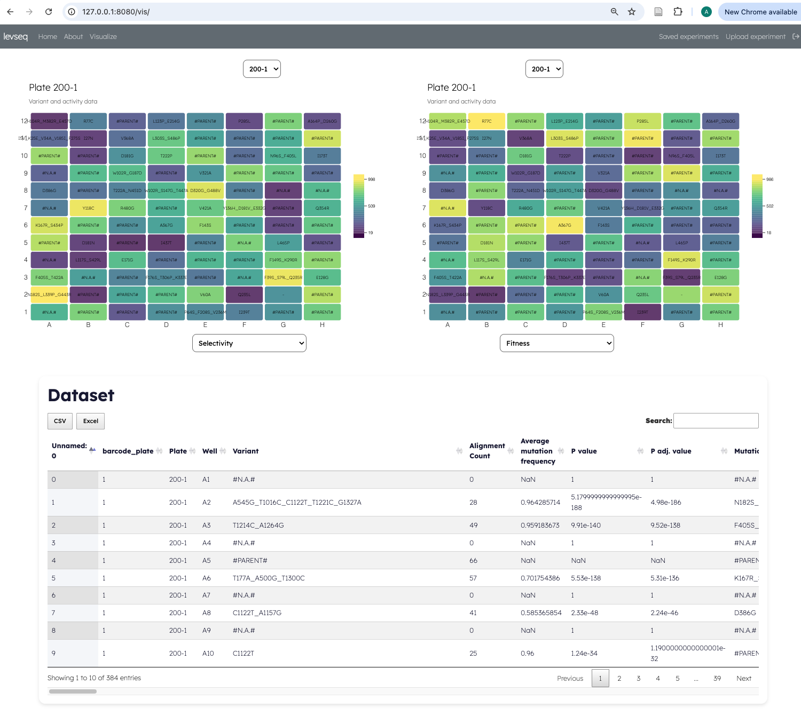

# levseq

Web app for locally hosting levseq. Our goal is to make this also as a centralised resource, for this we are 
working with other protein database managers and software engineers, so stay tuned! We would love feedback in 
the meantime about how we can improve sequnece function data collection and sharing. If you have any suggestions
please post an issue, we would love to build this into a community driven thing.

## Running once setup


```bash
docker compose up postgres
```

```bash
docker compose up flask-dev
```

Then just go to your local server: `http://127.0.0.1:8080/` you should be able to see the below!




## Database setup (only run the first time)

You'll need to create a .env file with the following variables:

```
DB_URL=postgresql://{the user below}:{the password below}@postgres:5432/{name of the DB}
DB_USER=
DB_PASSWORD=
SECRET_KEY=
```

You need to have docker installed for this to work, this has been tested on a mac and linux!

** TBH I had issues running the database so I combined it into the docker compose. This could be problematic for a 
full prod deployment so something to consider.**

First run docker compose to spin everything up:
```bash
docker compose up postgres
```

```bash
docker compose up flask-dev
```

Find the container ID of your flask and postgres containers:

```
docker ps 
```
Should look something like:

```
CONTAINER ID   IMAGE          COMMAND                  CREATED             STATUS             PORTS                                                                                  NAMES
83baf2dbbd3a   665a47a0ce37   "npm start"              About an hour ago   Up About an hour   0.0.0.0:2992->2992/tcp, :::2992->2992/tcp, 0.0.0.0:8080->5000/tcp, :::8080->5000/tcp   evseq_app_flask-dev_1
4623059f56b7   b9390dd1ea18   "docker-entrypoint.s…"   About an hour ago   Up About an hour   5432/tcp                                                                               evseq_app_postgres_1
```
Exec into the postgres db by running:

```
docker exec -it 4623059f56b7 bash
```

Where 4623059f56b7 is the container ID from before.

Once logged in then you need to initialise the database by running the initDB sql.
```
psql -U ylong levseq

```
Now paste in all the sql statements in `init_db.sql`.

To look at the table ya can go:
```
\l

\c levseq

\dt
```

If there is nothing there copy and paste the init_db.sql in!

## Now you can access the website

Just go to 127.0.0.1:8080 and you should see 
## Re-Build docker images
```
docker compose build postgres
docker compose build flask-dev
```

## Database Schema

### **1. Roles Table**

| Column      | Type          | Constraints           |
|-------------|---------------|-----------------------|
| `role_id`   | SERIAL        | PRIMARY KEY           |
| `role_name` | VARCHAR(255)  | NOT NULL, UNIQUE      |
| `description` | TEXT        |                       |

### **2. Users Table**

| Column       | Type                    | Constraints                              |
|--------------|-------------------------|------------------------------------------|
| `user_id`    | SERIAL                  | PRIMARY KEY                              |
| `role_id`    | INT                     | FOREIGN KEY REFERENCES `roles(role_id)`  |
| `username`   | VARCHAR(80)             | UNIQUE, NOT NULL                         |
| `email`      | VARCHAR(80)             | UNIQUE, NOT NULL                         |
| `password`   | BYTEA                   |                                          |
| `created_at` | TIMESTAMP WITH TIME ZONE| DEFAULT CURRENT_TIMESTAMP, NOT NULL      |
| `first_name` | VARCHAR(30)             |                                          |
| `last_name`  | VARCHAR(30)             |                                          |
| `active`     | BOOLEAN                 | DEFAULT FALSE                            |
| `is_admin`   | BOOLEAN                 | DEFAULT FALSE                            |

### **3. Groups Table**

| Column      | Type                    | Constraints                             |
|-------------|-------------------------|-----------------------------------------|
| `group_id`  | SERIAL                  | PRIMARY KEY                             |
| `user_id`   | INT                     | FOREIGN KEY REFERENCES `users(user_id)` |
| `owner_id`  | INT                     | FOREIGN KEY REFERENCES `users(user_id)` |
| `group_name`| VARCHAR(255)            |                                         |
| `created_at`| TIMESTAMP WITH TIME ZONE| DEFAULT CURRENT_TIMESTAMP               |

### **4. Experiments Table**

| Column            | Type                    | Constraints                                       |
|-------------------|-------------------------|---------------------------------------------------|
| `experiment_id`   | SERIAL                  | PRIMARY KEY                                       |
| `user_created`    | INT                     | FOREIGN KEY REFERENCES `users(user_id)`           |
| `group_id`        | INT                     | FOREIGN KEY REFERENCES `groups(group_id)`         |
| `name`            | VARCHAR(255)            |                                                   |
| `meta`            | JSONB                   |                                                   |
| `created_at`      | TIMESTAMP WITH TIME ZONE| DEFAULT CURRENT_TIMESTAMP                         |
| `date_last_edited`| TIMESTAMP WITH TIME ZONE|                                                   |

### **5. Data Table**

| Column         | Type                    | Constraints                                           |
|----------------|-------------------------|-------------------------------------------------------|
| `data_id`      | SERIAL                  | PRIMARY KEY                                           |
| `user_created` | INT                     | FOREIGN KEY REFERENCES `users(user_id)`               |
| `group_id`     | INT                     | FOREIGN KEY REFERENCES `groups(group_id)`             |
| `experiment_id`| INT                     | FOREIGN KEY REFERENCES `experiments(experiment_id)`   |
| `type`         | VARCHAR(255)            |                                                       |
| `data`         | JSONB                   |                                                       |
| `created_at`   | TIMESTAMP WITH TIME ZONE| DEFAULT CURRENT_TIMESTAMP                             |
| `date_edited`  | TIMESTAMP WITH TIME ZONE|                                                       |

### Notes
- **FOREIGN KEY Constraints**: Ensure relational integrity between tables.
- **SERIAL Type**: Auto-increments, ideal for primary keys.
- **UNIQUE Constraints**: Ensure unique values in specific columns.
- **BYTEA for Passwords**: Used for storing hashed passwords, indicating binary data.

## Docker Quickstart


This app can be run completely using `Docker` and `docker compose`. **Using Docker is recommended, as it guarantees the application is run using compatible versions of Python and Node**.

There are three main services:

To run the development version of the app

```bash
docker compose up flask-dev
```

To run the production version of the app

```bash
docker compose up flask-prod
```

The list of `environment:` variables in the `docker compose.yml` file takes precedence over any variables specified in `.env`.

To run any commands using the `Flask CLI`

```bash
docker compose run --rm manage <<COMMAND>>
```

Therefore, to initialize a database you would run

```bash
docker compose run --rm manage db init
docker compose run --rm manage db migrate
docker compose run --rm manage db upgrade
```

A docker volume `node-modules` is created to store NPM packages and is reused across the dev and prod versions of the application. For the purposes of DB testing with `sqlite`, the file `dev.db` is mounted to all containers. This volume mount should be removed from `docker compose.yml` if a production DB server is used.

Go to `http://localhost:8080`. You will see a pretty welcome screen.

### Running locally

Run the following commands to bootstrap your environment if you are unable to run the application using Docker

```bash
cd levseq
pip install -r requirements/dev.txt
npm install
npm run-script build
npm start  # run the webpack dev server and flask server using concurrently
```

Go to `http://localhost:5000`. You will see a pretty welcome screen.

#### Database Initialization (locally)

Once you have installed your DBMS, run the following to create your app's
database tables and perform the initial migration

```bash
flask db init
flask db migrate
flask db upgrade
```

## Deployment

When using Docker, reasonable production defaults are set in `docker compose.yml`

```text
FLASK_ENV=production
FLASK_DEBUG=0
```

Therefore, starting the app in "production" mode is as simple as

```bash
docker compose up flask-prod
```

If running without Docker

```bash
export FLASK_ENV=production
export FLASK_DEBUG=0
export DATABASE_URL="<YOUR DATABASE URL>"
npm run build   # build assets with webpack
flask run       # start the flask server
```

## Shell

To open the interactive shell, run

```bash
docker compose run --rm manage shell
flask shell # If running locally without Docker
```

By default, you will have access to the flask `app`.

## Running Tests/Linter

To run all tests, run

```bash
docker compose run --rm manage test
flask test # If running locally without Docker
```

To run the linter, run

```bash
docker compose run --rm manage lint
flask lint # If running locally without Docker
```

The `lint` command will attempt to fix any linting/style errors in the code. If you only want to know if the code will pass CI and do not wish for the linter to make changes, add the `--check` argument.

## Migrations

Whenever a database migration needs to be made. Run the following commands

```bash
docker compose run --rm manage db migrate
flask db migrate # If running locally without Docker
```

This will generate a new migration script. Then run

```bash
docker compose run --rm manage db upgrade
flask db upgrade # If running locally without Docker
```

To apply the migration.

For a full migration command reference, run `docker compose run --rm manage db --help`.

If you will deploy your application remotely (e.g on Heroku) you should add the `migrations` folder to version control.
You can do this after `flask db migrate` by running the following commands

```bash
git add migrations/*
git commit -m "Add migrations"
```

Make sure folder `migrations/versions` is not empty.

## Asset Management

Files placed inside the `assets` directory and its subdirectories
(excluding `js` and `css`) will be copied by webpack's
`file-loader` into the `static/build` directory. In production, the plugin
`Flask-Static-Digest` zips the webpack content and tags them with a MD5 hash.
As a result, you must use the `static_url_for` function when including static content,
as it resolves the correct file name, including the MD5 hash.
For example

```html
<link rel="shortcut icon" href="{{static_url_for('static', filename='build/favicon.ico') }}">
```

If all of your static files are managed this way, then their filenames will change whenever their
contents do, and you can ask Flask to tell web browsers that they
should cache all your assets forever by including the following line
in ``.env``:

```text
SEND_FILE_MAX_AGE_DEFAULT=31556926  # one year
```


# Old DB stuff


```
docker pull postgres
```

```
docker run --name evseqdb -e POSTGRES_USER=ylong -e POSTGRES_PASSWORD=apassword -e POSTGRES_DB=levseq -p 5433:5432 -d postgres 
```

Since we're using a persistent database we first need to create the user who will be owning it:

First we login to postgres and setup a database called **levseq**.

```
CREATE DATABASE levseq;
```
Run the DB script in the `dev.db` file (i.e. connect to postgres and run the db script). In docker you can update 
the docker file to be like:

```
# Install PostgreSQL
USER root
RUN apt-get update && apt-get install -y postgresql postgresql-contrib
# Setup the initial database and user (customize these commands as needed)
RUN service postgresql start &&\
    su postgres -c "psql -c \"CREATE USER youruser WITH SUPERUSER PASSWORD 'yourpassword';\"" &&\
    su postgres -c "createdb -O youruser yourdatabase"

```

Then we need to make a user who is the owner.
``` 
sudo -u postgres  /Applications/Postgres.app/Contents/Versions/12/bin/psql -p5439
``` 

or something like:
```
sudo -u postgres psql
``` 
Next create the user:

```
CREATE USER ylong WITH PASSWORD 'longseqislong';
``` 

Grant privileges:
```
GRANT ALL PRIVILEGES ON DATABASE levseq TO APASSWORD;
```

Check it worked.


(Update the password before you go to prod ;) 
```
ALTER USER ylong WITH PASSWORD 'newpassword';
```
